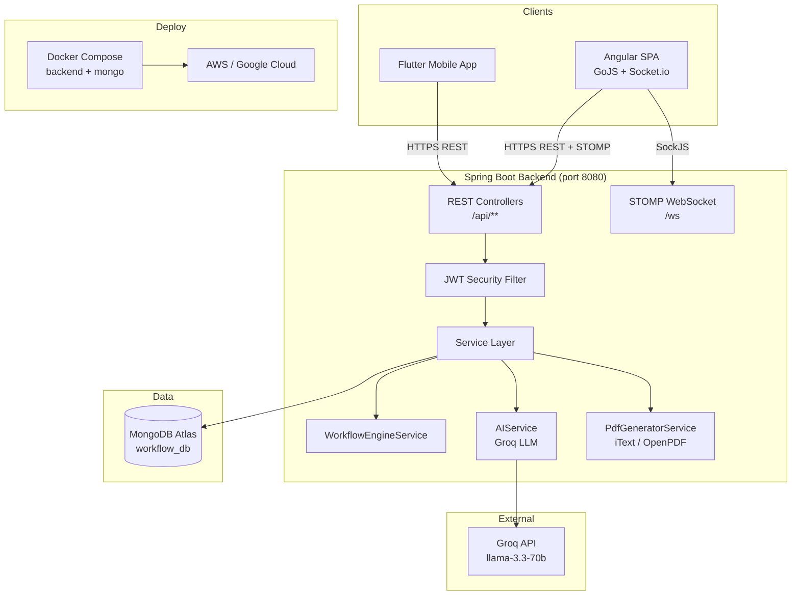

# Design Document — Workflow Management System

## Overview

The Workflow Management System (WMS) is a multi-tier platform that lets organizations model, publish, and execute business process policies (políticas) as UML 2.5 Activity Diagrams with Swimlanes. The system exposes a Spring Boot REST + WebSocket API consumed by an Angular web frontend, a Flutter mobile app, and an AI assistant layer backed by Groq/OpenAI-compatible LLMs.

The existing codebase (`com.workflow.backend`) already implements the core domain: `Politica`, `Tramite`, `Tarea`, `Nodo`, `Notificacion`, `HistorialTramite`, and `Usuario` models; `WorkflowEngineService` for automatic routing; STOMP/SockJS WebSocket notifications; JWT-based stateless authentication; and a Groq-backed `AIService`. This design document formalizes the complete architecture, fills in missing components (PDF generation, department management, analytics, required-field validation, NumeroReferencia persistence), and defines the correctness properties that guide property-based testing.

---

## Architecture

### High-Level System Diagram



### Technology Stack

| Layer | Technology | Version |
|---|---|---|
| Backend framework | Spring Boot | 3.5.13 |
| Language | Java | 21 |
| Database | MongoDB (Atlas) | 7.x |
| ORM | Spring Data MongoDB | — |
| Security | Spring Security + JJWT | 0.12.6 |
| WebSocket | Spring WebSocket (STOMP/SockJS) | — |
| AI | Spring AI + Groq (OpenAI-compatible) | 1.1.4 |
| PDF | OpenPDF (iText fork, LGPL) | 1.3.x |
| Frontend | Angular 17+ | — |
| Diagram editor | GoJS | 2.x |
| Mobile | Flutter | 3.x |
| Containerization | Docker + Docker Compose | — |

### Package Structure (Backend)

```
com.workflow.backend
├── ai/                     # AIService — LLM integrations
├── config/                 # JwtUtil, JwtFilter, SecurityConfig, WebSocketConfig
├── controllers/            # REST controllers (one per aggregate)
├── dto/                    # Request/response DTOs
├── enums/                  # EstadoPolitica, EstadoTramite, EstadoTarea, RolUsuario
├── exception/              # BusinessException, ResourceNotFoundException, GlobalExceptionHandler
├── models/                 # MongoDB documents and embedded objects
├── repositories/           # Spring Data MongoDB repositories
├── services/               # Business logic services (SRP)
└── websocket/              # NotificacionWebSocket — STOMP message sender
```

---

## Components and Interfaces

### REST Controllers

| Controller | Base Path | Primary Responsibility |
|---|---|---|
| `AuthController` | `/api/auth` | Login, register |
| `UsuarioController` | `/api/usuarios` | User CRUD (ADMIN) |
| `DepartamentoController` *(new)* | `/api/departamentos` | Department CRUD (ADMIN) |
| `PoliticaController` | `/api/politicas` | Policy CRUD + lifecycle |
| `TramiteController` | `/api/tramites` | Trámite creation, query, initiation |
| `TareaController` | `/api/tareas` | Task query + completion |
| `NotificacionController` | `/api/notificaciones` | Notification read/mark-read |
| `AIController` | `/api/ai` | AI copilot, form assistant, bottleneck |
| `PdfController` *(new)* | `/api/pdf` | PDF download for completed trámites |
| `AnalyticsController` *(new)* | `/api/analytics` | Bottleneck dashboard data |
| `DataSeederController` | `/api/seed` | Dev-only data seeding |

### Service Layer

| Service | Responsibility |
|---|---|
| `AuthService` | Credential validation, JWT issuance, user registration |
| `UsuarioService` | User CRUD, deactivation |
| `DepartamentoService` *(new)* | Department CRUD |
| `PoliticaService` | Policy CRUD, lifecycle transitions, graph validation |
| `TramiteService` | Trámite creation, NumeroReferencia generation, initiation |
| `TareaService` | Task queries, status updates, required-field validation |
| `WorkflowEngineService` | Automatic routing: TASK → DECISION → PARALLEL → END |
| `NotificacionService` *(new)* | Centralized notification persistence + WebSocket dispatch |
| `PdfGeneratorService` *(new)* | PDF rendering from completed Trámite data |
| `AnalyticsService` *(new)* | Average duration computation per Nodo/Departamento/Funcionario |
| `AIService` | Diagram copilot, form data extraction, bottleneck analysis, chatbot |

### WebSocket Component

`NotificacionWebSocket` sends STOMP messages to topic destinations:

| Destination | Audience | Trigger |
|---|---|---|
| `/topic/admin` | All ADMINs | New Trámite submitted, bottleneck alert |
| `/topic/funcionario/{id}` | Specific Funcionario | New Tarea assigned |
| `/topic/departamento/{dept}` | All Funcionarios in dept | Tarea updated by colleague |
| `/topic/cliente/{id}` | Specific Cliente | Trámite advanced, completed |
| `/topic/politica/{id}` | Editors of same Política | Collaborative diagram change |

---

## Data Models

### MongoDB Collections

#### `usuarios`
```java
@Document(collection = "usuarios")
public class Usuario {
    @Id String id;
    String nombre;
    @Indexed(unique = true) String email;
    String password;          // bcrypt hash
    RolUsuario rol;           // ADMIN | FUNCIONARIO | CLIENTE
    String departamento;      // name reference (denormalized)
    boolean activo = true;
    LocalDateTime fechaCreacion;
}
```

#### `departamentos` *(new collection)*
```java
@Document(collection = "departamentos")
public class Departamento {
    @Id String id;
    @Indexed(unique = true) String nombre;
    String descripcion;
    String responsableId;     // ADMIN or lead FUNCIONARIO
    LocalDateTime fechaCreacion;
}
```

#### `politicas`
```java
@Document(collection = "politicas")
public class Politica {
    @Id String id;
    String nombre;
    String descripcion;
    String categoria;
    String organizacion;
    Integer tiempoEstimadoDias;
    List<Nodo> nodos;         // embedded graph
    EstadoPolitica estado;    // BORRADOR | ACTIVA | INACTIVA
    String creadoPorId;
    String nombreCreadoPor;
    Integer version;
    Integer tramitesActivos;
    Integer tramitesCompletados;
    LocalDateTime fechaCreacion;
    LocalDateTime fechaActualizacion;
    LocalDateTime fechaActivacion;
}
```

#### `Nodo` (embedded in Politica)
```java
public class Nodo {
    String id;
    String nombre;
    String descripcion;
    String tipo;              // START | END | TASK | DECISION | PARALLEL
    String departamento;
    String responsableId;
    String nombreResponsable;
    Integer tiempoLimiteHoras;
    double posX, posY;        // canvas position for GoJS
    List<String> conexiones;
    Map<String, String> condiciones;  // DECISION: {"true": nodoId, "false": nodoId}
    List<Map<String, Object>> camposFormulario;
    List<String> documentosRequeridos;
    String color;
}
```

#### `tramites`
```java
@Document(collection = "tramites")
public class Tramite {
    @Id String id;
    @Indexed String politicaId;
    String nombrePolitica;
    @Indexed String clienteId;
    String nombreCliente;
    String nodoActualId;
    String nombreNodoActual;
    String departamentoActual;
    EstadoTramite estado;     // NUEVO | EN_PROCESO | COMPLETADO | RECHAZADO
    String descripcion;
    @Indexed(unique = true) String numeroReferencia;  // TRM-YYYY-NNNN
    String prioridad;         // BAJA | MEDIA | ALTA
    List<HistorialTramite> historial;
    Map<String, Object> datosFormulario;
    String observacionFinal;
    LocalDateTime fechaInicio;
    LocalDateTime fechaFin;
    LocalDateTime fechaUltimaActualizacion;
    Long duracionMinutos;
}
```

#### `HistorialTramite` (embedded in Tramite)
```java
public class HistorialTramite {
    String nodoId;
    String nombreNodo;
    String departamento;
    String funcionarioId;
    String nombreFuncionario;
    String accion;            // COMPLETADO | RECHAZADO | INICIADO
    String observacion;
    String resultadoDecision; // APROBADO | RECHAZADO (DECISION nodes only)
    Long duracionMinutos;
    LocalDateTime fecha;
}
```

#### `tareas`
```java
@Document(collection = "tareas")
public class Tarea {
    @Id String id;
    @Indexed String tramiteId;
    String politicaId;
    String nodoId;
    String nombreNodo;
    String departamento;
    @Indexed String funcionarioId;
    String nombreFuncionario;
    String numeroReferenciaTramite;
    String nombrePolitica;
    String instrucciones;
    EstadoTarea estado;       // PENDIENTE | EN_PROCESO | COMPLETADO | RECHAZADO
    Map<String, Object> formularioDatos;
    String observacion;
    String prioridad;
    LocalDateTime fechaAsignacion;
    LocalDateTime fechaCompletado;
    Long duracionMinutos;
}
```

#### `notificaciones`
```java
@Document(collection = "notificaciones")
public class Notificacion {
    @Id String id;
    @Indexed String usuarioId;
    String mensaje;
    String tipo;              // NUEVA_TAREA | TRAMITE_COMPLETADO | TRAMITE_RECHAZADO
                              // CUELLO_BOTELLA | TAREA_VENCIDA | SISTEMA
    String referenciaId;
    String tipoReferencia;    // TRAMITE | TAREA
    boolean leida;
    LocalDateTime fechaCreacion;
    LocalDateTime fechaLeida;
}
```

### MongoDB Indexes

| Collection | Field | Type |
|---|---|---|
| `usuarios` | `email` | unique |
| `tramites` | `numeroReferencia` | unique |
| `tramites` | `clienteId` | standard |
| `tramites` | `politicaId` | standard |
| `tareas` | `tramiteId` | standard |
| `tareas` | `funcionarioId` | standard |
| `notificaciones` | `usuarioId` | standard |
| `departamentos` | `nombre` | unique |

### NumeroReferencia Generation

The current `TramiteService` uses an in-memory `AtomicLong` counter which resets on restart. The production implementation must use a MongoDB sequence document:

```java
// Collection: sequences
// { "_id": "tramite_2026", "seq": 42 }
// Use findAndModify with $inc to atomically increment
```

`TramiteService.generarNumeroReferencia()` must be updated to use `MongoTemplate.findAndModify()` with `Update.update("seq", 1).inc("seq")` on a `sequences` collection, keyed by year, to guarantee uniqueness across restarts and replicas.

---

## API Design

### Authentication

| Method | Path | Auth | Description |
|---|---|---|---|
| POST | `/api/auth/login` | Public | Returns JWT + user profile |
| POST | `/api/auth/register` | Public | Creates user, returns JWT |

**Login Response:**
```json
{
  "token": "eyJ...",
  "id": "userId",
  "email": "user@example.com",
  "nombre": "Juan Pérez",
  "rol": "FUNCIONARIO",
  "departamento": "Legal"
}
```

### Users

| Method | Path | Auth | Description |
|---|---|---|---|
| GET | `/api/usuarios` | ADMIN | List all users |
| GET | `/api/usuarios/{id}` | ADMIN, FUNCIONARIO | Get user by id |
| PUT | `/api/usuarios/{id}` | ADMIN | Update user |
| DELETE | `/api/usuarios/{id}` | ADMIN | Delete user |

### Departments *(new)*

| Method | Path | Auth | Description |
|---|---|---|---|
| GET | `/api/departamentos` | ADMIN, FUNCIONARIO | List all departments |
| POST | `/api/departamentos` | ADMIN | Create department |
| PUT | `/api/departamentos/{id}` | ADMIN | Update department |
| DELETE | `/api/departamentos/{id}` | ADMIN | Delete department |

### Policies

| Method | Path | Auth | Description |
|---|---|---|---|
| GET | `/api/politicas` | ADMIN | List all policies |
| GET | `/api/politicas/activas` | Any | List ACTIVA policies |
| GET | `/api/politicas/{id}` | Any | Get policy by id |
| POST | `/api/politicas` | ADMIN | Create policy (BORRADOR) |
| PUT | `/api/politicas/{id}` | ADMIN | Update policy graph |
| PUT | `/api/politicas/{id}/activar` | ADMIN | Publish (BORRADOR → ACTIVA) |
| PUT | `/api/politicas/{id}/desactivar` | ADMIN | Deactivate (ACTIVA → INACTIVA) |
| DELETE | `/api/politicas/{id}` | ADMIN | Delete BORRADOR policy |

### Trámites

| Method | Path | Auth | Description |
|---|---|---|---|
| GET | `/api/tramites` | ADMIN | List all trámites |
| GET | `/api/tramites/{id}` | Any | Get trámite by id |
| GET | `/api/tramites/cliente/{clienteId}` | CLIENTE, ADMIN | Client's trámites |
| GET | `/api/tramites/{id}/progreso` | Any | Progress map |
| GET | `/api/tramites/referencia/{ref}` | Any | Lookup by NumeroReferencia *(new)* |
| POST | `/api/tramites/iniciar` | ADMIN, CLIENTE | Create + start trámite |
| PUT | `/api/tramites/{id}/iniciar` | ADMIN | Transition NUEVO → EN_PROCESO *(new)* |

### Tasks

| Method | Path | Auth | Description |
|---|---|---|---|
| GET | `/api/tareas/funcionario/{id}` | FUNCIONARIO, ADMIN | Tasks by funcionario |
| GET | `/api/tareas/departamento/{dept}` | FUNCIONARIO, ADMIN | Tasks by department *(new)* |
| GET | `/api/tareas/{id}` | Any | Get task by id |
| PUT | `/api/tareas/{id}/estado` | FUNCIONARIO | Update task state *(new)* |
| PUT | `/api/tareas/{id}/completar` | FUNCIONARIO | Complete task + advance workflow |

### Notifications

| Method | Path | Auth | Description |
|---|---|---|---|
| GET | `/api/notificaciones/usuario/{id}` | Any | All notifications |
| GET | `/api/notificaciones/usuario/{id}/no-leidas` | Any | Unread notifications |
| GET | `/api/notificaciones/usuario/{id}/conteo` | Any | Unread count |
| PUT | `/api/notificaciones/{id}/leer` | Any | Mark as read |
| PUT | `/api/notificaciones/usuario/{id}/leer-todas` | Any | Mark all as read |

### AI

| Method | Path | Auth | Description |
|---|---|---|---|
| POST | `/api/ai/diagrama` | ADMIN | Diagram copilot command |
| POST | `/api/ai/extraer-datos` | FUNCIONARIO | Form data extraction |
| GET | `/api/ai/cuellos-botella/{politicaId}` | ADMIN | Bottleneck analysis |
| POST | `/api/ai/asistente` | Any | General chatbot |

### PDF *(new)*

| Method | Path | Auth | Description |
|---|---|---|---|
| GET | `/api/pdf/tramite/{id}` | CLIENTE, ADMIN | Download PDF for completed trámite |

### Analytics *(new)*

| Method | Path | Auth | Description |
|---|---|---|---|
| GET | `/api/analytics/nodos/{politicaId}` | ADMIN | Avg duration per Nodo |
| GET | `/api/analytics/departamentos` | ADMIN | Avg duration per Departamento |
| GET | `/api/analytics/funcionarios/{dept}` | ADMIN | Funcionario efficiency in dept |

---

## WebSocket Events

The backend uses STOMP over SockJS. The Angular frontend connects via `@stomp/ng2-stompjs`; Flutter uses `stomp_dart_client`.

### Connection

```
Endpoint: ws://host:8080/ws (SockJS fallback)
Auth: Pass JWT as query param ?token=... or in STOMP CONNECT headers
```

### Server → Client Messages

| Topic | Payload | Trigger |
|---|---|---|
| `/topic/admin` | `{ tipo, mensaje, referenciaId, tipoReferencia }` | New Trámite submitted; bottleneck alert |
| `/topic/funcionario/{userId}` | `{ tipo, mensaje, tareaId, tramiteRef }` | New Tarea assigned to this funcionario |
| `/topic/departamento/{dept}` | `{ tipo, mensaje, tareaId, estado }` | Tarea updated within department |
| `/topic/cliente/{userId}` | `{ tipo, mensaje, tramiteId, estado }` | Trámite advanced or completed |
| `/topic/politica/{politicaId}` | `{ tipo, cambio, nodo, conexion, editorId }` | Collaborative diagram edit |

### Client → Server Messages (SEND)

| Destination | Payload | Description |
|---|---|---|
| `/app/politica/{id}/editar` | `{ accion, nodo, conexion, editorId }` | Broadcast diagram change to co-editors |

### Notification Types

```
NUEVA_TAREA          — Funcionario: new task assigned
TRAMITE_COMPLETADO   — Cliente: trámite finished
TRAMITE_RECHAZADO    — Cliente: trámite rejected
TRAMITE_AVANZADO     — Cliente: trámite moved to next department
CUELLO_BOTELLA       — Admin: bottleneck detected
TAREA_ACTUALIZADA    — Departamento: colleague updated a task
SISTEMA              — Any: system-level message
```

---

## New Components — Implementation Details

### DepartamentoController + DepartamentoService

```java
@RestController
@RequestMapping("/api/departamentos")
public class DepartamentoController {
    @GetMapping          // ADMIN, FUNCIONARIO
    @PostMapping         // ADMIN — create
    @PutMapping("/{id}") // ADMIN — update
    @DeleteMapping("/{id}") // ADMIN — delete (reject if funcionarios assigned)
}
```

`DepartamentoService.delete()` must check `usuarioRepository.findByDepartamento(nombre)` and throw `BusinessException` if any active users are assigned.

### PdfGeneratorService

Uses OpenPDF (LGPL fork of iText 2.x) to avoid licensing issues:

```xml
<dependency>
    <groupId>com.github.librepdf</groupId>
    <artifactId>openpdf</artifactId>
    <version>1.3.30</version>
</dependency>
```

```java
@Service
public class PdfGeneratorService {
    public byte[] generarPdfTramite(Tramite tramite) {
        // 1. Validate estado == COMPLETADO
        // 2. Build Document with header: logo, title, reference
        // 3. Add metadata table: policy, client, dates, duration
        // 4. Add historial table: step, dept, funcionario, action, date, duration
        // 5. Add datosFormulario section: key-value pairs
        // 6. Return byte[]
    }
}
```

`PdfController`:
```java
@GetMapping("/api/pdf/tramite/{id}")
public ResponseEntity<byte[]> downloadPdf(@PathVariable String id, Principal principal) {
    Tramite tramite = tramiteService.getById(id);
    // Authorization: ADMIN or tramite.clienteId == principal.userId
    if (tramite.getEstado() != EstadoTramite.COMPLETADO)
        throw new BusinessException("El trámite no está completado");
    byte[] pdf = pdfGeneratorService.generarPdfTramite(tramite);
    return ResponseEntity.ok()
        .header(HttpHeaders.CONTENT_DISPOSITION, "attachment; filename=tramite-" + tramite.getNumeroReferencia() + ".pdf")
        .contentType(MediaType.APPLICATION_PDF)
        .body(pdf);
}
```

### AnalyticsService

```java
@Service
public class AnalyticsService {
    // Average duracionMinutos per nodoId across all COMPLETADO tareas
    public Map<String, Double> promediosPorNodo(String politicaId) { ... }

    // Average duracionMinutos per departamento
    public Map<String, Double> promediosPorDepartamento() { ... }

    // Per-funcionario average within a department, sorted slowest→fastest
    public List<FuncionarioStats> eficienciaFuncionarios(String departamento) { ... }
}
```

### Required-Field Validation in WorkflowEngineService

Before completing a Tarea, `WorkflowEngineService.completarTarea()` must validate required fields:

```java
private void validarCamposRequeridos(Nodo nodo, Map<String, Object> datos) {
    if (nodo.getCamposFormulario() == null) return;
    for (Map<String, Object> campo : nodo.getCamposFormulario()) {
        boolean requerido = Boolean.TRUE.equals(campo.get("requerido"));
        String nombre = (String) campo.get("nombre");
        if (requerido && (datos == null || !datos.containsKey(nombre)
                || datos.get(nombre) == null
                || datos.get(nombre).toString().isBlank())) {
            throw new BusinessException("Campo requerido faltante: " + nombre);
        }
    }
}
```

This is called after loading the `Nodo` and before marking the `Tarea` as `COMPLETADO`.

### Trámite Initiation Separation

Currently `TramiteService.iniciarTramite()` creates the Trámite in `NUEVO` state and immediately creates the first Tarea (effectively auto-initiating). Per Requirement 7, the Admin must explicitly initiate. The flow should be:

1. `POST /api/tramites/iniciar` — creates Trámite with `estado = NUEVO`, no Tarea yet. Sends WebSocket notification to `/topic/admin`.
2. `PUT /api/tramites/{id}/iniciar` — ADMIN-only; transitions `NUEVO → EN_PROCESO`, creates first Tarea, sends notification to Funcionario.

`TramiteService` needs a new `iniciarPorAdmin(String tramiteId)` method:

```java
public Tramite iniciarPorAdmin(String tramiteId) {
    Tramite tramite = getById(tramiteId);
    if (tramite.getEstado() != EstadoTramite.NUEVO)
        throw new BusinessException("Solo se pueden iniciar trámites en estado NUEVO");
    tramite.setEstado(EstadoTramite.EN_PROCESO);
    // create first Tarea via WorkflowEngineService or inline
    // send WebSocket notification to funcionario
    return tramiteRepository.save(tramite);
}
```

### Collaborative Editing WebSocket Handler

```java
@Controller
public class DiagramaWebSocketController {
    @MessageMapping("/politica/{id}/editar")
    @SendTo("/topic/politica/{id}")
    public DiagramaCambioDTO procesarCambio(
            @DestinationVariable String id,
            DiagramaCambioDTO cambio) {
        // Optionally persist partial state to MongoDB
        return cambio;
    }
}
```

`DiagramaCambioDTO`:
```java
public record DiagramaCambioDTO(
    String tipo,        // AGREGAR_NODO | ELIMINAR_NODO | MOVER_NODO | CONECTAR | DESCONECTAR
    String editorId,
    Nodo nodo,
    String desdeId,
    String hastaId,
    double posX,
    double posY
) {}
```

---

## Error Handling

The existing `GlobalExceptionHandler` covers the main cases. The following additions are needed:

| Exception | HTTP Status | When |
|---|---|---|
| `ResourceNotFoundException` | 404 | Entity not found by id |
| `BusinessException` | 400 | Business rule violation |
| `AccessDeniedException` | 403 | Spring Security RBAC rejection |
| `DuplicateKeyException` | 409 | MongoDB unique index violation (email, numeroReferencia) |
| `MethodArgumentNotValidException` | 422 | Bean Validation failures |
| `Exception` (catch-all) | 500 | Unexpected errors |

`GlobalExceptionHandler` must add a handler for `org.springframework.dao.DuplicateKeyException` to return HTTP 409 with a descriptive message, covering the unique email and unique `numeroReferencia` constraints.

All error responses follow the existing structure:
```json
{
  "error": "Descriptive message",
  "status": 409,
  "timestamp": "2026-01-15T10:30:00"
}
```

Sensitive internal details (stack traces, MongoDB query details) must never be exposed in production responses. The catch-all handler already masks these with `"Error interno: " + ex.getMessage()`.

---

## Testing Strategy

### Dual Testing Approach

Unit tests cover specific examples, edge cases, and error conditions. Property-based tests verify universal invariants across many generated inputs. Both are required for comprehensive coverage.

### Property-Based Testing Library

**jqwik** (JUnit 5 extension) is the chosen PBT library for the Java backend:

```xml
<dependency>
    <groupId>net.jqwik</groupId>
    <artifactId>jqwik</artifactId>
    <version>1.8.4</version>
    <scope>test</scope>
</dependency>
```

Each property test runs a minimum of **100 iterations** (jqwik default: 1000). Each test is tagged with:
```java
// Feature: workflow-management-system, Property N: <property text>
```

### Unit Test Coverage Targets

- `WorkflowEngineService`: routing logic for TASK, DECISION, PARALLEL, END
- `TramiteService`: NumeroReferencia generation, state transitions
- `PoliticaService`: graph validation (START/END count), lifecycle transitions
- `AuthService`: credential validation, JWT issuance
- `PdfGeneratorService`: PDF content completeness
- `AnalyticsService`: average computation correctness

### Integration Test Coverage

- WebSocket notification delivery (STOMP test client)
- MongoDB unique index enforcement (email, numeroReferencia)
- Concurrent Trámite creation (uniqueness under load)
- AI endpoints with mocked `ChatClient`

### Flutter / Angular Testing

- Angular: Jasmine/Karma unit tests for services; Cypress E2E for critical flows
- Flutter: `flutter_test` widget tests; integration tests for API calls

